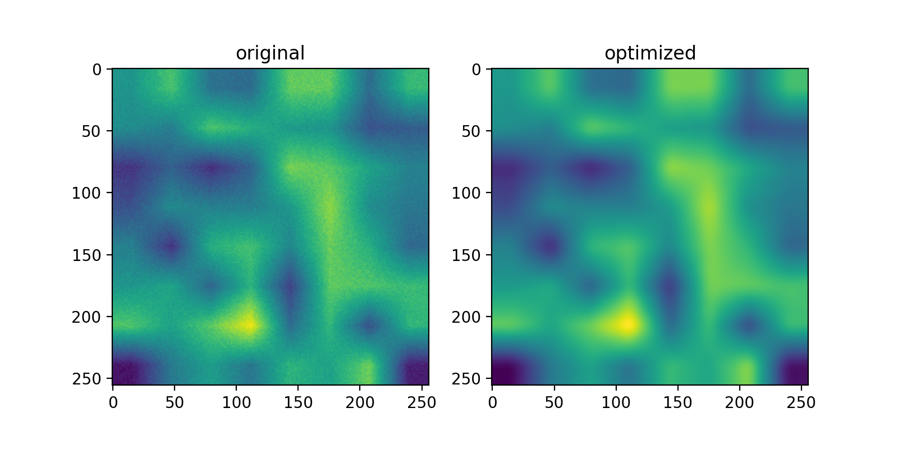

# Pytorch Smooth
The model has three main components
 * `sobel` to create horizontal sobel kernels
 * `Hessian` to calculate the hessian matrix per channel
 * `Smoothness` to calculate a smoothness value per channel

 ## Usage
 The smoothness module can be applied to neural network outputs and
 the resulting value can be substracted from the loss to
 train networks to give smooth outputs.

 ```python
 loss = loss - smoothness
 ```

 ## Example
 The example generates a non-smooth random image and uses gradient decent to smooth it out.
 

 ## Installation
 ```python
 pip install git+https://github.com/tasptz/pytorch-smooth
 ```
 